# One-Click Card Import

**A media import and processing tool for photography, videography, and post-production workflows.**

**The software ships with English and makes it easy to add multiple languages—simply place the language files into the language folder inside the software.**

One-Click Card Import was originally built to solve the problem of organizing, copying, and archiving media from storage cards after a shoot. Through continuous development, it has grown into a workflow tool that integrates **device recognition, media ingest, verification and backup, task management, transcoding, media browsing, on-site automatic ingest, and LAN collaboration**.

---

## Core Features

### Ingest

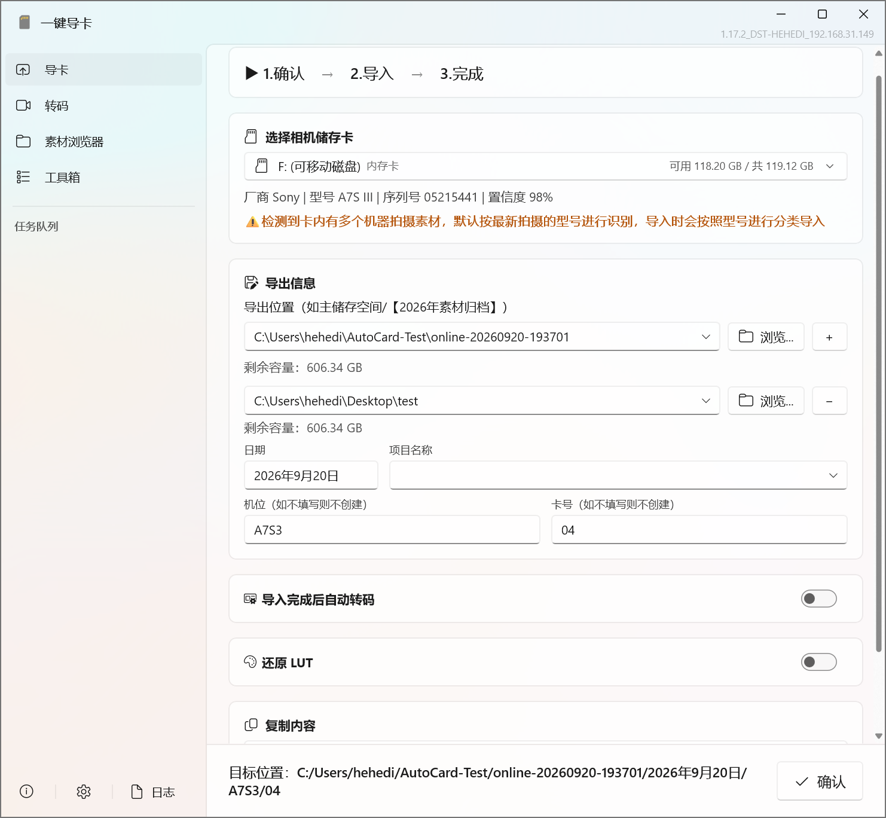

A media ingest workflow designed for camera cards and audio recorder cards.

* Automatically recognizes vendor, model, serial number, and camera position
* Supports video, photos, RAW, audio, and sidecar files
* Supports import modes such as video + photos / video only / photos only
* Supports incremental import and duplicate media detection
* Supports resume from interruption
* Supports recovery of unfinished tasks
* Supports multi-target export and backup
* Supports mixed-card detection and archiving by camera model
* Supports archiving metadata such as project name, camera position, and card number

### Media Safety

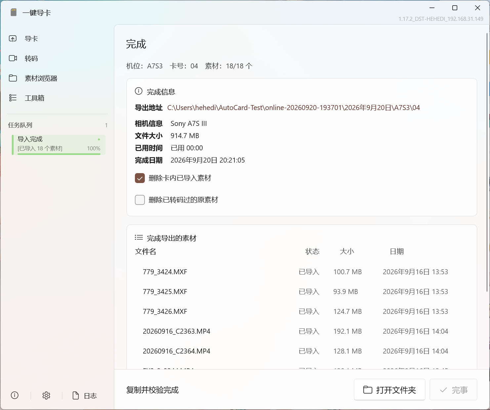

The ingest process is designed around the principles of **verifiable media and no accidental deletion of source files**.

* Checks target disk space before import
* File import verification
* Duplicate media detection
* Resume from interruption
* Pre-deletion precheck
* Safe deletion
* Automatically keeps source media when target files are abnormal
* Provides detailed reasons for import failures
* Generates export records after import completes

Duplicate detection uses information such as file name, size, and fast hash; stricter content verification can be used for safe deletion.

### Camera Recognition

Determines device models by combining multiple pieces of media evidence, including:

* Camera directory structure
* Video / clip metadata
* EXIF / XMP
* Vendor and model fingerprints
* Media capture time
* Camera serial number

For storage cards that have not been reformatted and have been used with different cameras, it also supports mixed-card detection and model arbitration, and archives media according to the recognition result.

Unknown devices will not be forced into an incorrect model; when identification cannot be confirmed, the original information is preserved as much as possible.

---

## Task Queue

Ingest and transcoding tasks are unified in the task queue.

Supports:

* Multiple parallel tasks
* Concurrency control
* Queue scheduling
* Retry on failure
* Resume from interruption
* Task recovery after app restart
* Task completion summaries
* Windows system notifications
* LAN task status viewing

---

## Transcoding

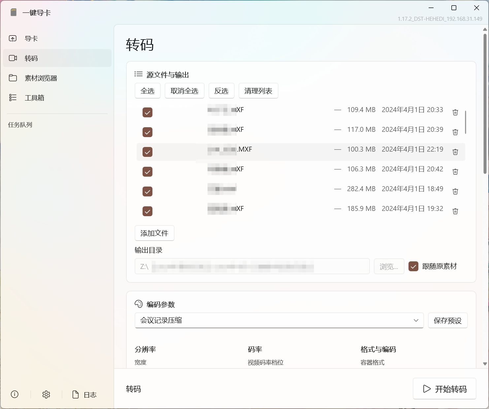

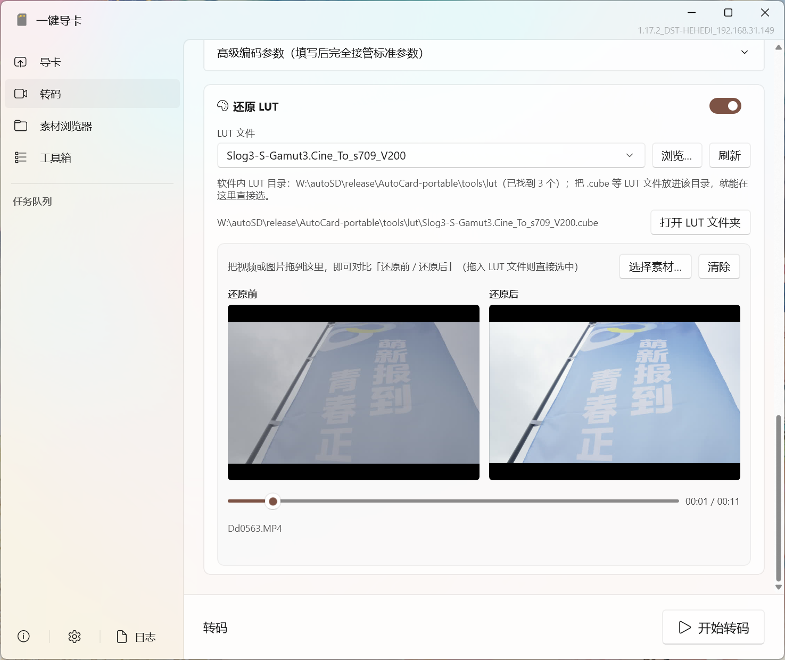

Built on the bundled FFmpeg / ffprobe.

Supports:

* H.264 / H.265 / VP9 / AV1 and other codecs
* Hardware-accelerated encoding
* Resolution / frame rate adjustment
* Follow source
* CRF / CQ quality modes
* Two-pass encoding
* HDR → SDR
* Color space conversion
* Audio loudness normalization
* LUT restoration
* Custom FFmpeg parameters
* Batch transcoding
* Custom presets
* File-level resume

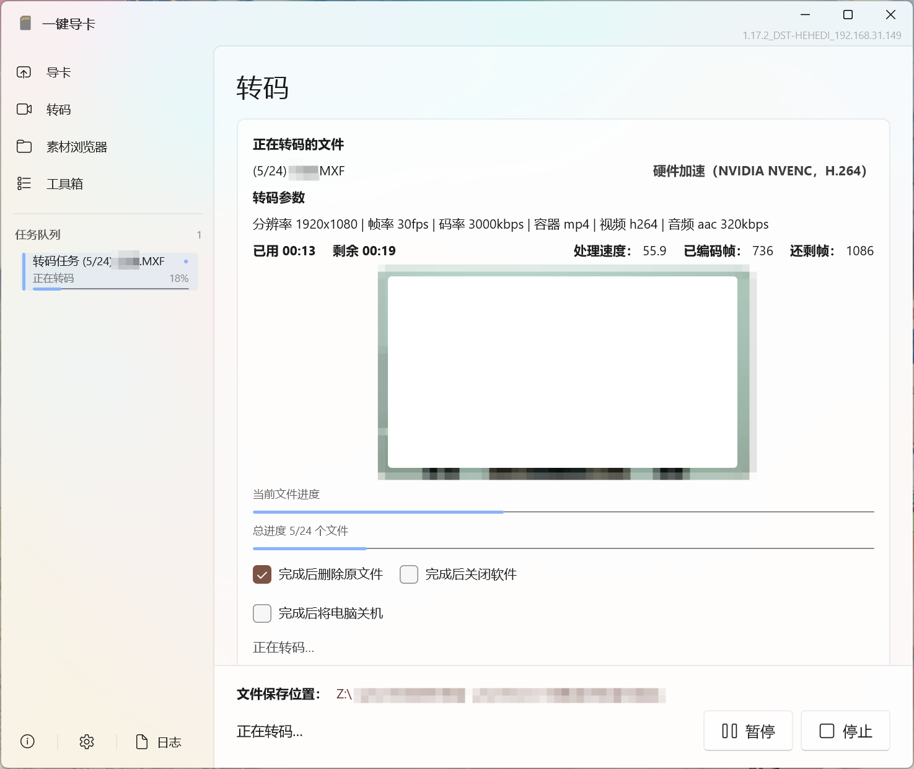

It also provides a proxy workflow:

* Automatically generates a Proxy folder
* Associates proxy files with source media
* Automatically generates CSV / EDL / XML manifests

This makes it easy to continue working in post-production software such as Premiere Pro and DaVinci Resolve.

---

## Media Browser

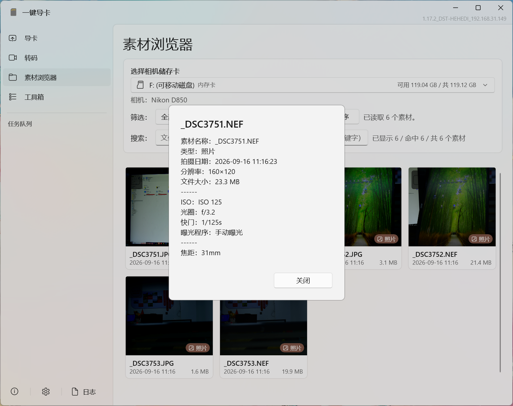

After inserting a storage card, you can browse the media on the card directly.

Supports:

* Video / photo / audio filtering
* Search by file name, path, date, camera, type, and extension
* Sort by file name, capture time, size, duration, and type
* Thumbnail browsing
* Multi-select and batch transcoding
* Source file deletion
* Detailed media information
* Refresh card files

Media details display different information depending on the media type.

For video, you can view duration, resolution, frame rate, bit rate, codec, color, bit depth, and more;

For photos, EXIF / TIFF information is supported, including RAW media;

For audio, duration, bit rate, codec, sample rate, bit depth, and more are supported.

---

## Quick Preview

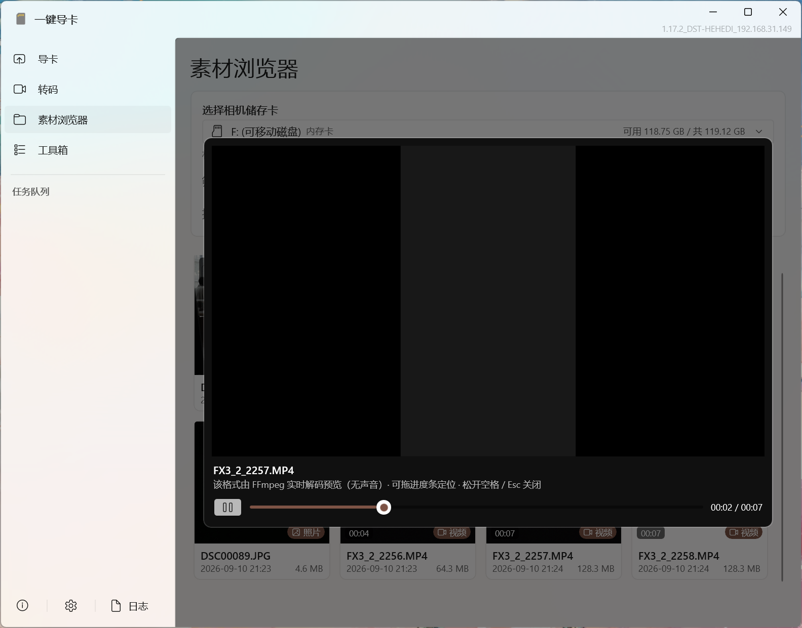

The Media Browser provides a quick way to review and cull footage on site:

**Move the mouse over a media card → hold Space**

to preview quickly.

Supports:

* Video playback
* Video seeking
* Audio playback
* Image zoom
* Image panning
* RAW media browsing

Video preview uses the bundled FFmpeg for decoding to improve compatibility with professional video formats.

---

## LAN Tasks

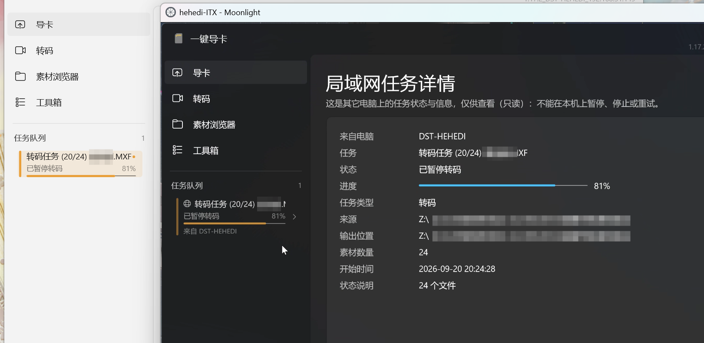

Multiple computers on the same LAN can view each other's task status.

Can share:

* Details of ongoing tasks
* Project names

Remote tasks are displayed in read-only form; they do not directly control tasks on other computers or directly access remote disks.

It also provides independent controls for LAN broadcast, detail viewing, and project name sync.

---

## Toolbox

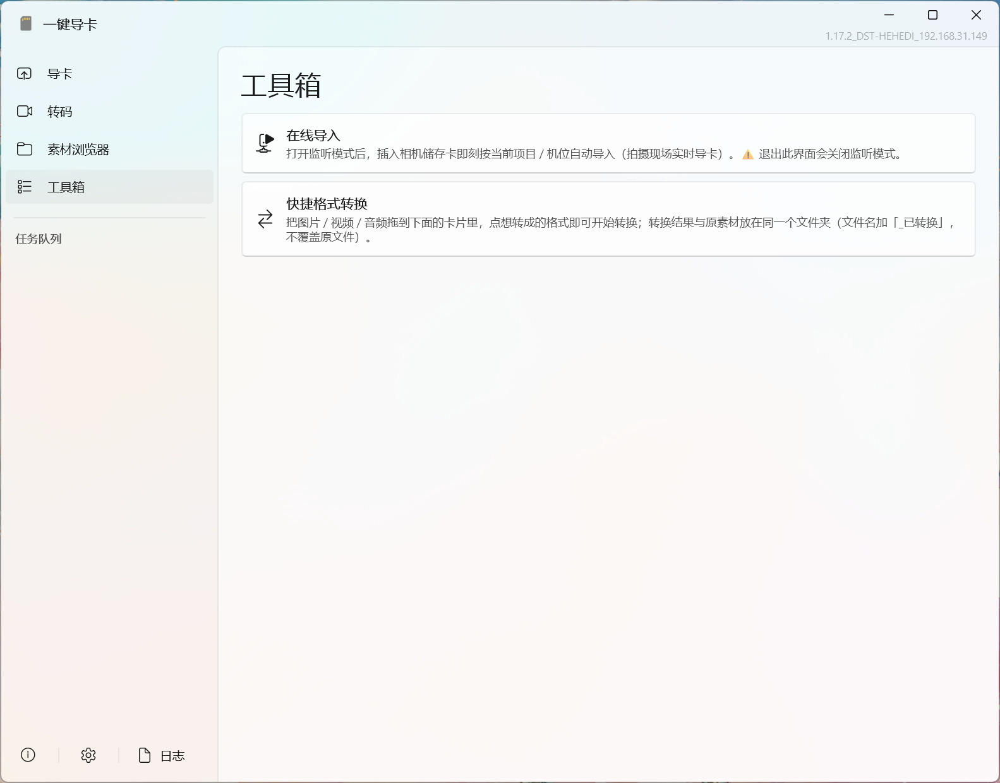

The Toolbox uses a modular design.

Tools are loaded as independent modules, so tools can be added or removed without affecting the core functionality of the main application.

Currently available:

### Online Ingest

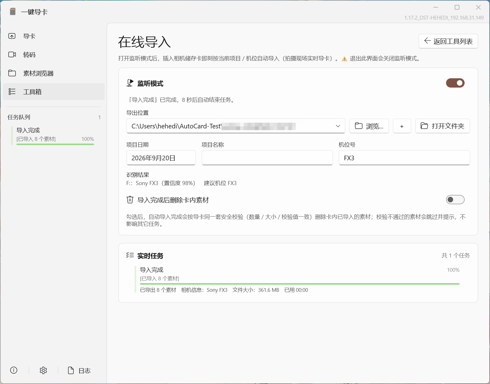

Used for automatic card ingest on set.

### Quick Format Conversion

Used to quickly convert image, audio, and video formats.

It provides target formats based on media type, along with batch processing, frame extraction, audio extraction, and more.

---

## Logs and Archiving

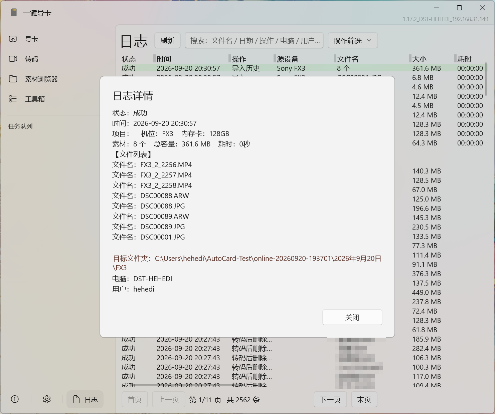

The software records major business operations, including:

* Ingest
* Ingest history
* Transcoding
* Deletion
* Delete transcoded source media
* Ingest failures
* Related operation results

Logs support:

* Search
* Filtering
* Pagination
* Detail viewing
* Custom log directory
* Network shared log directory

After each ingest completes, the following file is also maintained in the project directory:

```text
[日期][项目名]_导出详情.xlsx
```

It records information such as project, date, export time, camera, camera position, card number, media count, total size, target location, and file status.

---

## Workflow

One-Click Card Import aims to cover more than just the "copy files" step; it covers the complete media pre-processing workflow:

```text
Storage Card
  ↓
Device Recognition
  ↓
Media Scan
  ↓
Ingest & Archive
  ↓
Verify / Backup
  ↓
Transcode / Proxy
  ↓
Media Browsing
  ↓
Task Management
  ↓
Logs & Export Records
```

The core goal is to reduce repetitive operations and minimize human error on set and during media archiving.

---

## Performance and Reliability

The software is specifically designed for large amounts of media, long-running tasks, and abnormal interruptions.

This includes:

* Large-directory virtualization
* Viewport-based thumbnail loading
* Thumbnail caching
* Background media scanning
* Background metadata reading
* Task state persistence
* Atomic writes and backup recovery
* Ingest resume
* Transcode resume
* Task recovery after abnormal exit
* Separation of technical logs and business logs

In practical testing, the UI remains responsive even with large numbers of media files present.

---

## Download

Go to GitHub Releases to get the latest version:

[Releases](../../releases)

Currently, the **Windows version** is primarily provided.

This project is currently **closed-source software** and its source code is not publicly available for now.

---

## System Requirements

The software currently targets the Windows desktop environment.
However, Mac and Linux versions are also within the development scope.

Some system runtime components are provided with the package. If the installer detects that the computer does not have these components, it will install them automatically.

---

## License

### One-Click Card Import

One-Click Card Import itself is **proprietary software**.

```text
Copyright © 2026 hehedi. All Rights Reserved.
```

Except for the rights of use expressly granted by this project, all copyrights and other intellectual property rights are reserved.

Without prior written permission from the copyright owner, you may not:

* Copy or redistribute this software
* Modify or create derivative versions
* Decompile, disassemble, or attempt to obtain the source code
* Remove or modify copyright and rights notices
* Repackage this software as another product for distribution
* Sell, rent, sublicense, or provide unauthorized commercial redistribution

For the complete license terms, see:

[`LICENSE`](LICENSE)

---

## Third-Party Components

One-Click Card Import uses several third-party open-source components.

These components **are not part of this project's closed-source portion**, and their use and redistribution remain subject to their respective licenses.

Major components include:

| Component             | Purpose                                  |
| --------------------- | ---------------------------------------- |
| .NET                  | Application runtime environment          |
| Windows App SDK       | Windows app framework                    |
| CommunityToolkit.Mvvm | MVVM / application infrastructure        |
| FFmpeg / ffprobe      | Media parsing, preview, and transcoding  |
| Other third-party libraries | Listed according to actual usage    |

> Note: The licenses of third-party components are independent of the proprietary software license of One-Click Card Import itself.

---

## Disclaimer

This software is intended to assist with importing, organizing, and processing photo and video media.

Although the software includes safeguards for ingest verification, exception recovery, safe deletion, and similar scenarios, any storage device, operating system, file system, USB interface, or third-party media component may encounter unforeseen issues.

For important footage, always keep an independent backup and verify that the backup is complete before deleting the original media.

Do not upload files that contain personal privacy, project privacy, or unreleased footage.

---

Designed by **hehedi**

Copyright © 2026 hehedi. All Rights Reserved.
